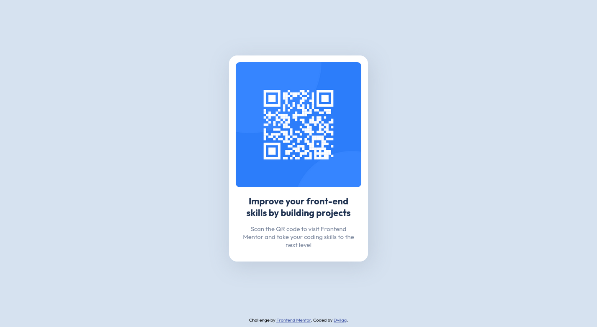
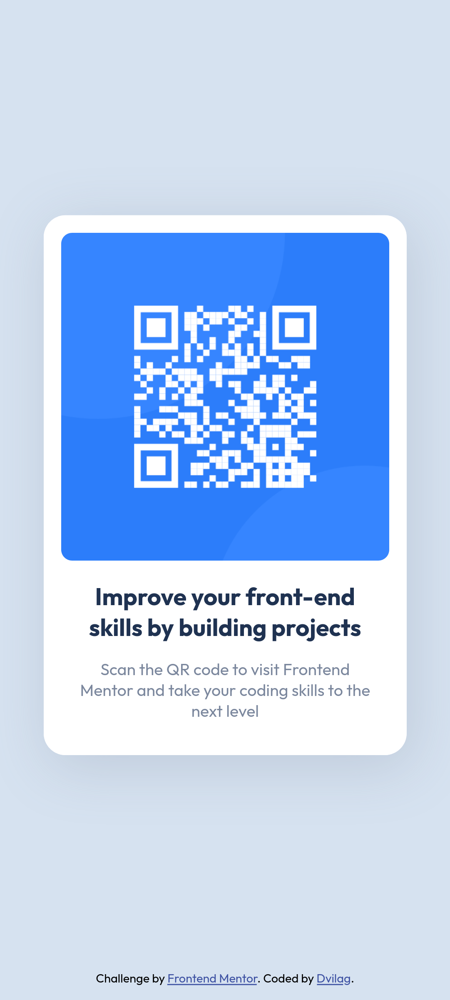

# Frontend Mentor - QR code component solution

This is a solution to the [QR code component challenge on Frontend Mentor](https://www.frontendmentor.io/challenges/qr-code-component-iux_sIO_H). Frontend Mentor challenges help you improve your coding skills by building realistic projects. 

## Table of contents

- [Overview](#overview)
  - [Screenshots](#desktop-design-screenshot)
  - [Links](#links)
- [My process](#my-process)
  - [Built with](#built-with)
  - [What I learned](#what-i-learned)
  - [Useful resources](#useful-resources)
- [Author](#author)

## Overview

### Desktop Design Screenshot

### Mobile Design Screenshot

### Links

- Solution URL: [Add solution URL here](https://your-solution-url.com)
- Live Site URL: [Add live site URL here](https://your-live-site-url.com)

## My process

### Built with

- Semantic HTML5 markup
- SASS custom properties
- Flexbox
- Mobile-first workflow

### What I learned

I used this challenge to recap some of the basic concepts of HTML and CSS. In that case, I used the superset of CSS, SASS.

### Useful resources

- [HTML Tutorial](https://www.w3schools.com/html/default.asp) - This helped me for having a lot of resources to understand the standard markup language.
- [SASS Documentation](https://sass-lang.com/documentation) - This is the official website of SASS which helped me finally understand how to use it and integrate in my HTML. I'd recommend it to anyone still learning this concept.

**Note: Delete this note and replace the list above with resources that helped you during the challenge. These could come in handy for anyone viewing your solution or for yourself when you look back on this project in the future.**

## Author

- Frontend Mentor - [@dvilagdev](https://www.frontendmentor.io/profile/dvilagdev)
